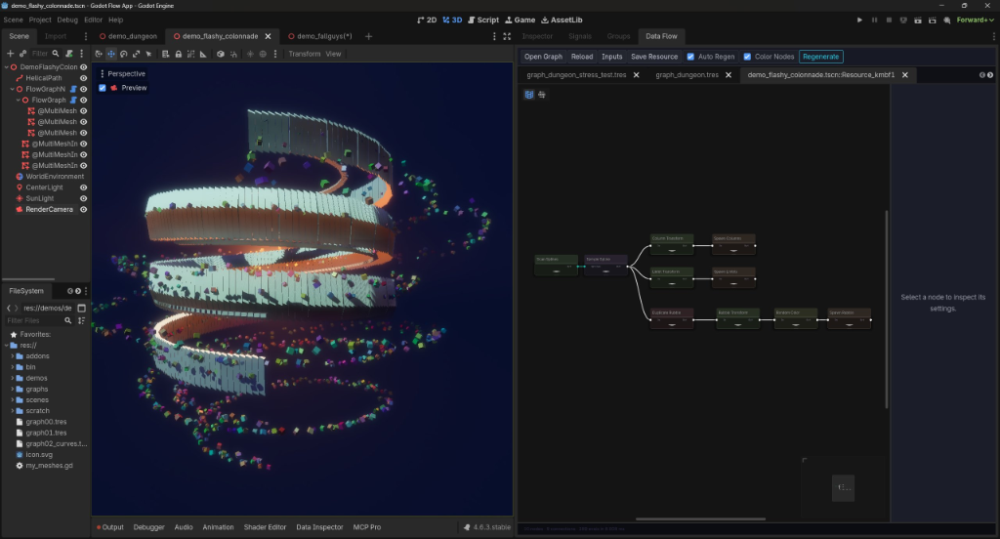
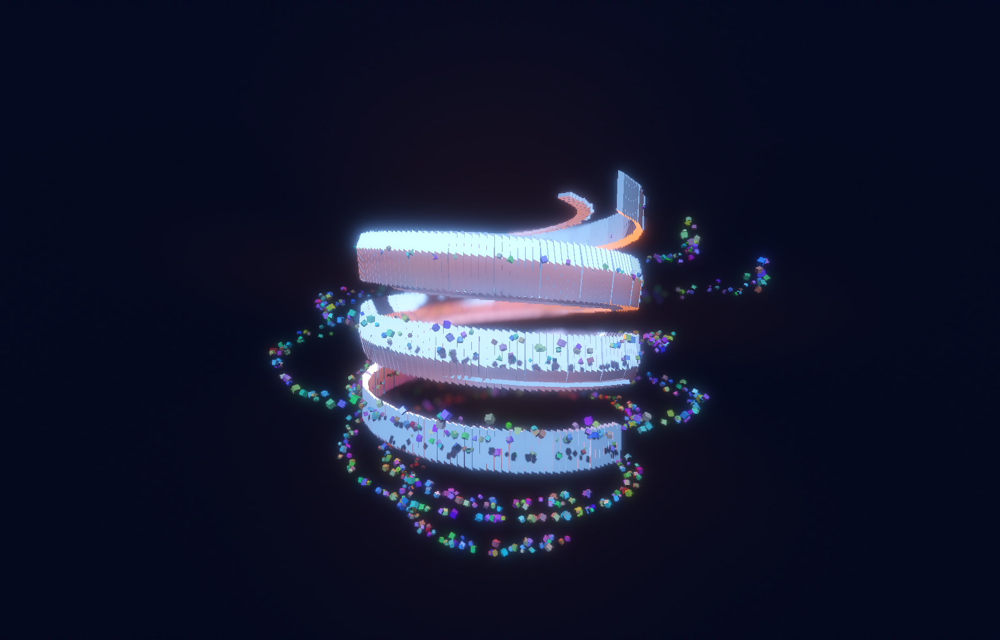
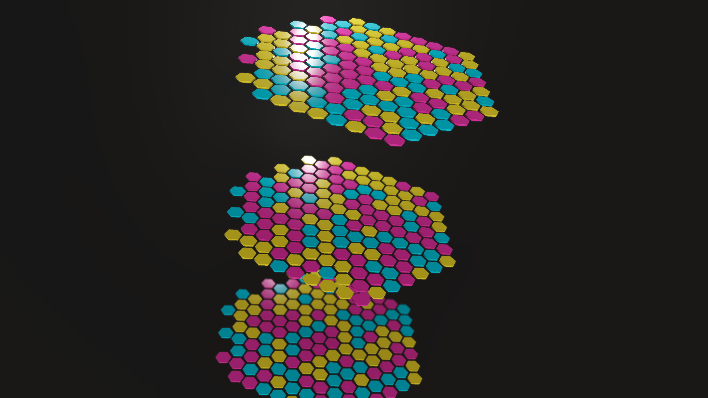
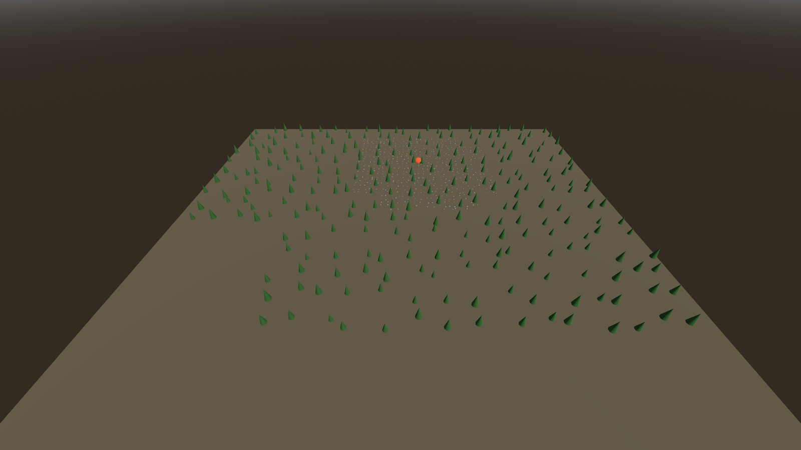
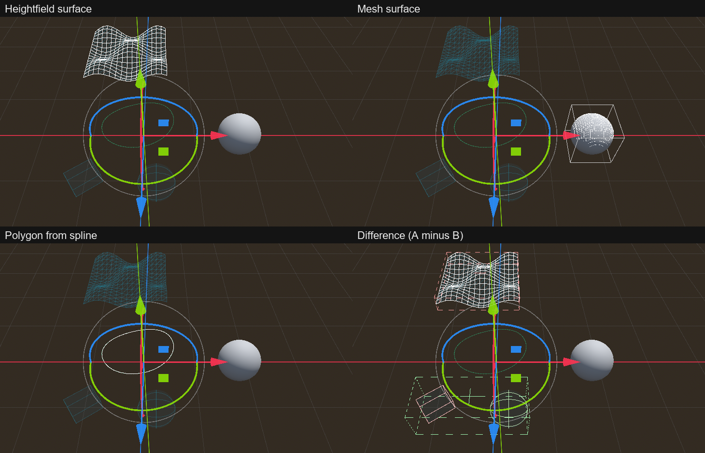

# PCGODOT

[](https://godotengine.org)
[](LICENSE)

**Unreal PCG-style node-graph procedural content for Godot 4.** Build scatter systems, spline fences, dungeons, and full level-generation pipelines in a visual graph editor docked inside the Godot editor — with the data model, hotkeys, and node vocabulary Unreal PCG users already know.

PCGODOT is a fork and major expansion of [Godot Flow](https://github.com/yabadabu/godot_flow) by yabadabu.



### 🎬 Demo Video

https://github.com/user-attachments/assets/fe29dea7-82c0-481c-a022-46050b05642d

---

## Coming from Unreal PCG?

**Read [docs/COMING_FROM_UNREAL_PCG.md](docs/COMING_FROM_UNREAL_PCG.md).** It has a 5-minute orientation, a hotkey table (D/A/E work exactly as in UE), a concept dictionary (`$Density` → `density`, `$Seed` → `seed`, `@Last` → `@last`, ...), a full UE-node → PCGODOT-node dictionary, and three classic UE tutorials (forest scatter, density-noise clumping, spline fence) translated node by node. The add-node search popup understands UE node names — type "Static Mesh Spawner" and you'll find it.

For what does **not** translate yet (GPU execution, partition cells saved as level data, an editor-viewport generation source, ...), see the honest gap list in [docs/PARITY_ROADMAP.md](docs/PARITY_ROADMAP.md#remaining-gaps).

---

## What's new

**Parity round 2** brings the addon's architecture and vocabulary much closer to Unreal PCG (design contract: [docs/PARITY_ROUND2.md](docs/PARITY_ROUND2.md)):

* A compiled, cached **executor** with opt-in threaded execution and an output cache (same output as a plain run).
* **Spatial data** (splines, surfaces, volumes and their composites) as first-class wire data, drawn in the 3D viewport.
* **Hierarchical and runtime generation** with `FlowWorld3D`, and **terrain adapters** (heightmaps, meshes, Terrain3D, HTerrain) that carry paint-layer weights.
* New **attribute types** (Vector2, Vector4, Transform, Int64, Double), many new nodes, richer **spawners** (collision, selectors, spline meshes, pooling) and **loops** (per entry, partition or chunk).
* A **node conformance harness** and a [manual editor check](docs/MANUAL_EDITOR_CHECK.md) for what headless tests cannot see.

**Updating a project that vendors the addon**

* Round 2 did not change any golden or seed-zero baseline entry. Behaviour changes made for production feedback and the review fixes are listed in [docs/DEPRECATIONS.md](docs/DEPRECATIONS.md); work through every row dated after your last sync.
* Node scripts are stateless `RefCounted` **elements** now; the editor shows them through a separate `FlowNodeWidget`. Keep `extends FlowNodeBase` in your own nodes, and do not call `free()` on a node element.
* Graphs saved by earlier versions are migrated in memory when they load (graph format v2) and are written in the new format on the next save.
* The docked editor needs **Godot 4.6 or newer**.

---

## Features

* **167 node templates** covering samplers, spatial data and set operations, density workflows, attribute/metadata ops, filters, spawners, control flow, and generators — see the [Node Library Reference](demo/addons/flow_nodes_editor/doc/nodes_reference.md) (every script in `nodes/` except the `*_settings.gd` resources, UE-named alias templates such as `copy_points` and `mesh_sampler` included).
* **UE PCG parity core**: per-point `density` (0..1, sampler-initialized) and `seed` (position-derived, deterministic) streams, optional per-point `bounds_min`/`bounds_max`/`steepness`; `density_filter`, `attribute_noise`, `normal_to_density`, and `projection` nodes; UE node names as search aliases.
* **Spatial data**: splines, surfaces (meshes, heightmaps, polygons) and volumes (collision shapes, CSG, meshes) travel on the wire as shapes, combine with Difference / Intersection / Union before any point exists, and become points through Surface Sampler, Volume Sampler, Spline Sampler or To Point. Points tested against a shape use their bounds box, as in Unreal (`overlap_mode`).
* **Hierarchical and runtime generation**: `FlowWorld3D` generates one graph over a world in grid cells, like Unreal's partitioned PCG component. `grid_size` markers put nodes on levels (the rest run once, Unbounded), coarse cells feed the finer cells they contain, each cell is its own `FlowGraphNode3D`, and cells are generated on demand, on load, or at runtime around generation sources (per-level radii, cleanup hysteresis, frame budget, pooling). `get_execution_bounds` and `cull_points_outside_bounds` give graphs the cell bounds.
* **Terrain adapters**: `get_surface_data` reads `HeightMapShape3D` collision, heightmap images with splat layers, terrain meshes, and Terrain3D / HTerrain nodes (detected by their methods; the suite uses fakes of the plugin APIs, and a manual run against the real plugins passed on Windows), and Surface Sampler writes one `layer_<name>` weight per paint layer onto the points.
* **Attribute types**: Bool, Int, Int64, Float, Double, Vector2, Vector, Vector4, Color, Quaternion, Transform, String and object references, with `attribute_cast`, `compare_op`, `copy_attribute`, `vector_op` / `trig_op` / `transform_op` / `bitwise_op` / `attribute_string_op`, and UE selector aliases (`$Position`, `$Scale.y`, `$BoundsMin`, `@Source`).
* **Spawners**: `spawn_meshes` mesh entries (weights, materials, shadows, visibility ranges, render layers, per-instance custom data, collision) with weighted / by-attribute / cycling selectors, `spawn_spline_mesh`, `spawn_scenes` / `spawn_nodes` with attribute-driven property overrides, `create_target_node` containers, and opt-in instance pooling.
* **Unreal-style executor**: stateless node elements, a compiled graph cached per resource, synchronous / time-sliced / threaded execution, and an output cache. Threading and caching are opt-in and give the same output as a plain run.
* **Editor-docked graph editor** ("Data Flow" bottom panel) with right-click search, drag-wire-to-empty-space node creation, reroute dots (double-click a wire), comment frames, undo/redo, and JSON clipboard copy/paste.
* **Interactive 3D debugging**: press `D` on any node to draw its points as density-tinted cubes in the viewport, and its splines, surfaces, volumes and composites as lines; press `A` for a spreadsheet Data Inspector (a column per vector component, sorting, filtering, a summary for shape-only data) where clicking a row highlights the point in 3D.
* **Subgraphs & loops**: nest graphs as `.tres` resources with parameter pins and per-instance overrides, collapse any selection into a subgraph, and iterate with `loop` per point, per data entry (Unreal's Loop), per attribute partition or per chunk, with iteration index and key as runtime params, key-stable seeds, merged or per-iteration output, feedback, and a graph picked per iteration (`graph_attribute`; `subgraph` too).
* **Attribute selector syntax**: component access (`position.x`), `@last`, `@data.<name>` per-data attributes, virtual streams (`index`, `front`/`up`/`right`), Yaw/Pitch/Roll and `$Position`-style aliases.
* **Native acceleration**: precompiled GDExtension (Windows/macOS) wrapping C++ KdTree and RTree for distance queries, difference/intersection, and self-pruning.
* **Runtime execution**: `FlowGraphNode3D` works like a UE PCG Component — `generate()` / `generate_async()` / `cleanup()` / `regenerate()`, a graph `seed`, per-instance `overrides`, `threaded` and `output_cache` options, a `generated` signal, `last_outputs` and `last_errors` — and `FlowNodeIO.evaluate()` runs a graph from code without any node in the scene.

---

## Quick Start

1. Clone the repo and open the **`demo/`** folder as a project in **Godot 4.6 or newer** (the docked editor uses `EditorDock`, which first shipped in 4.6; the native library itself loads from 4.4).
2. Open any scene in `demo/demos/` (start with `demo_sample_points.tscn` or `demo_random_subscenes.tscn`).
3. Click the `FlowGraphNode3D` in the scene tree — the **Data Flow** panel opens at the bottom of the editor with the node graph.
4. Right-click the canvas (or `Shift+A`) to add nodes; press `D` on a node to see its points in 3D, `A` to inspect its data table, `F` to zoom-fit.

To use the addon in your own project, copy `demo/addons/flow_nodes_editor/` into your project's `addons/` folder and enable **Flow Nodes Editor** under Project Settings → Plugins.

### Runtime execution

```gdscript
# A FlowGraphNode3D generates on _ready (disable with generate_on_ready = false).
var pcg : FlowGraphNode3D = $FlowGraphNode3D
pcg.seed = 1234                               # 0 = legacy: each node keeps its own random_seed
pcg.overrides = { "scatter/x": 5 }            # "<node name>/<setting>", this instance only
pcg.threaded = true                           # opt-in: pure nodes on WorkerThreadPool, same output
pcg.output_cache = true                       # opt-in: reuse outputs of unchanged pure nodes
pcg.generated.connect(func(outputs): print(outputs.keys()))

# generate(inputs, runtime_params). A setting bound to "$rows" in the node's
# Common Settings > bindings (for example { "z": "$rows" }) reads runtime_params.rows.
var outputs := pcg.regenerate({}, { "rows": 3 })   # cleanup() + generate(); name -> FlowData.Data
var count : int = outputs["points"].size()         # Data.size / first / container / get_data_attr
if not pcg.last_errors.is_empty():                  # [{ node, template, message }, ...]
	push_warning(str(pcg.last_errors))
pcg.cleanup()                                 # frees only this component's spawned nodes

# Or evaluate a graph resource directly: no node in the scene. Spawners and scene
# scanners then report "needs an owner node" and pass their input through.
var result := FlowNodeIO.evaluate(preload("res://graphs/my_graph.tres"),
		{ "width": 12 }, 1234, { "difficulty": 2 })
```

`execute()` still works (it is `generate()` without arguments). Set
`transient_output = true` to keep spawned nodes out of the saved scene, and
`async_generation = true` (with `frame_budget_ms`) or `generate_async()` to spread a
generation over frames. See [docs/RUNTIME_API_P0.md](docs/RUNTIME_API_P0.md) for the
full contract.

### Hierarchical and runtime generation

`FlowWorld3D` generates one graph over a world in cells (Unreal's partitioned PCG
component). Nodes downstream of a `grid_size` marker run once per cell of its size;
the rest run once for the whole world.

```gdscript
var world := FlowWorld3D.new()                    # Manual mode: nothing runs on its own
world.graph = load("res://graphs/my_world.tres")
world.world_bounds = AABB(Vector3(-128, -16, -128), Vector3(256, 32, 256))
scene_root.add_child(world)
world.cell_generated.connect(func(level, coord): print("generated L", level, " ", coord))
print(world.get_levels())                         # coarsest first: 0 (Unbounded), then the grid sizes
world.generate_bounds(AABB(Vector3(-16, -16, -16), Vector3(32, 32, 32)))
print(world.get_cells(FlowWorld3D.CellState.Generated).size(), " cells")
world.cleanup_all()
```

With `demo/graphs/graph_hierarchical.tres` (markers of 64 and 16) this prints
`[0, 64, 16]`, then the Unbounded cell, four 64 cells and four 16 cells, then
`9 cells`. Set `generation_mode` to `OnLoad` or `Runtime` before the node enters the
tree to generate every cell over the first frames, or the cells around generation
sources (any `Node3D` in the group `flow_generation_source`, or a
`FlowGenerationSource` child of the player) as they move. `demos/demo_hierarchical.tscn`
streams cells around an orbiting source; in the editor, `FlowWorld3D`'s inspector has
Generate All and Cleanup All buttons.

To tune one instance without duplicating its graph, set `overrides` on the
`FlowGraphNode3D` (`{"scatter/num_points": 200}`, or
`{"my_subgraph:scatter/num_points": 200}` to target a node inside one subgraph).
To drive a node setting from a graph input, runtime param or flow variable, add
`"property" -> "$param"` to that node's `bindings` (Common Settings). A wired
parameter port beats an override, which beats a binding, which beats the saved
value. See [Overrides and bindings](docs/COMING_FROM_UNREAL_PCG.md#overrides-and-bindings).

### Architecture

The addon follows Unreal PCG's split between settings, stateless elements and a
compiled, cached task graph. [Coming From Unreal PCG](docs/COMING_FROM_UNREAL_PCG.md#architecture-how-unreals-pcg-model-maps-here)
has the full mapping; in short:

* **Elements and widgets.** A node script (`nodes/<template>.gd`, `extends FlowNodeBase`)
  is a `RefCounted` runtime element: settings in, `execute(ctx)`, data out. Every run
  creates fresh elements and drops them afterwards. The editor shows each element
  through a `FlowNodeWidget` (a `GraphNode`), which owns the ports, colours, error
  text and debug draw; nodes with custom UI implement optional `widget_*` hooks.
* **Compiled graph and executor.** `FlowCompiledGraph.for_graph(graph)` parses a
  `FlowGraphResource` once (descriptors, links, execution order, migrated data) and
  keeps it until `graph.data` changes. `FlowExecutor` runs it synchronously
  (`generate()`, `FlowNodeIO.evaluate()`), time-sliced (`generate_async()`,
  `FlowNodeIO.begin_evaluation()`), or threaded. The editor dock runs each node
  through the same executor code as the runtime.
* **Threaded and output-cache modes (opt-in, off by default).** `threaded = true` runs
  independent pure nodes on `WorkerThreadPool`; nodes that touch the scene, physics,
  rendering or graph variables stay on the main thread in their usual order.
  `output_cache = true` stores the outputs of pure nodes in `FlowOutputCache`, keyed by
  settings, seed and input content, and hands out copies. `FlowNodeTraits` says which
  nodes are pure; unknown third-party nodes are treated as main-thread and uncached.
  Both modes produce exactly the output of a plain run. Call `FlowOutputCache.clear()`
  after editing a Curve or Mesh that a node setting references in place.

  > **Warning: script Loggers and threaded mode.** Errors and warnings a node prints
  > outside its own `setError` (a `push_error` from a `FlowData` helper, a
  > `push_warning`, an engine error) are raised on the worker thread, and Godot calls
  > every script `Logger` (`OS.add_logger`) on the raising thread. A Logger that is not
  > thread-safe can then corrupt memory and crash the process. Threaded mode runs the
  > nodes known to log this way one at a time (`FlowNodeTraits.LOGGING_TEMPLATES`), but
  > any pure node can still print an unforeseen engine error from a worker. Keep
  > `threaded` off, or make your Loggers thread-safe, when you register one.
* **Spatial data.** A `FlowData.Data` can carry a `FlowSpatial` shape on `Data.shape`
  (spline, polygon / mesh / heightfield surface, box / sphere / mesh volume, or a
  union / intersection / difference composite) instead of, or next to, point
  streams. Shapes are immutable and are sampled only when a sampler or To Point asks
  for points.
* **Hierarchical generation.** `FlowCompiledGraph` assigns every node a level from the
  `grid_size` markers upstream of it (the smallest size wins; no marker means the
  Unbounded level). `FlowWorld3D` runs each level per cell through a
  `FlowGraphNode3D` child (`FlowCell_L<size>_<x>_<z>`), coarse levels first, handing
  coarser outputs whole to the finer cells they contain. Cell ownership is half-open
  on X and Z, so `cull_points_outside_bounds` de-duplicates world-aligned scatter:
  Surface Sampler on surface data, Volume Sampler and To Point on volumes, and
  `grid_fill_bounds` with `world_anchored` give the same points through cells as in
  one piece; `sample_points` and the default `grid_fill_bounds` do not. Cleaned-up
  cell components are pooled.
* **Terrain adapters.** `FlowTerrainAdapter` (`terrain/`) reads heights, normals and
  paint-layer weights from `HeightMapShape3D`, heightmap images, meshes, and
  Terrain3D / HTerrain by duck typing, and builds a surface shape carrying the layers.
  The suite tests the two plugin adapters against fake classes that implement the
  plugin methods they call; they were also checked once against the real plugins
  (Terrain3D v1.0.2, HTerrain 1.8.1, Godot 4.7.1, Windows).
* **Loops.** `loop.iteration_mode` (Points, Entries, Partitions, Chunks),
  `output_mode` (Merge, Collection), per-iteration runtime params
  (`iteration_index`, `iteration_count`, `iteration_key`) and seeds derived from the
  iteration key; `graph_attribute` picks the graph per iteration.
* **Spawner descriptors.** `spawn_meshes.mesh_entries` holds `FlowMeshSpawnEntry`
  resources (mesh, weight, material, shadow, visibility range, layers, GI, custom
  data, collision). Everything a spawner creates carries `flow_owner` meta, so
  `cleanup()` frees exactly one component's output.
* **Runtime API.** `FlowGraphNode3D` (`generate`, `generate_async`, `cleanup`,
  `regenerate`, `seed`, `args`, `params`, `overrides`, `threaded`, `output_cache`,
  `generated`, `last_outputs`, `last_errors`), `FlowWorld3D` for partitioned
  generation, and `FlowNodeIO.evaluate` for owner-less runs, as in the examples above.

### Your own nodes

Keep project nodes **outside** the addon folder so the addon can be upgraded by
replacing its directory. List your node directories in
**Project Settings → Flow Nodes → Node Directories** (`flow_nodes/node_directories`;
the plugin registers it when enabled). The editor's add-node menu and runtime
`FlowNodeIO.evaluate_graph()` both resolve templates from those directories; nothing
needs to be registered by hand:

```ini
# project.godot
[flow_nodes]
node_directories=PackedStringArray("res://game/pcg_nodes")
```

A node is `<dir>/<template>.gd` extending `FlowNodeBase` (a `RefCounted` element: do
not `free()` it, and put any `GraphNode` UI code in the `widget_*` hooks documented at
the top of `node.gd`). If its output depends only on its settings, seed and inputs, add
`"pure": true` to its `meta_node` so threaded mode and the output cache can use it;
otherwise it runs on the main thread and is never cached. Its `meta_node` drives
everything the editor shows: `"title"`, `"tooltip"`, `"aliases"` (search), and
`"category"` (add-node submenu and node colour; `Sampler`/`Generator`, `Spatial`,
`Filter`, `Density`/`Math`, `Metadata`/`Attribute`, `Spawner`/`Transform`,
`ControlFlow`/`Utility`/`Debug`, `Input`/`Output` get their UE-style colour; any
other category gets a stable per-template colour). To give a project category one
colour, set `"hue"` (a float, 0..1) or `"color"` (a `Color`) in the `meta_node` of
each of its nodes; `color` wins over `hue`, and both win over the category table:

```gdscript
meta_node = { "title": "Room Loop", "category": "My Game", "hue": 0.62, ... }
```

Prefix template names with your project (`mygame_room_loop.gd`) to avoid
collisions; stock templates always win.

Addons that ship nodes can still call
`FlowNodeRegistry.register_node_directory("res://addons/your_addon/nodes")` from their
plugin; it merges with the project setting. Renamed templates can stay loadable
through `FlowNodeRegistry.template_aliases`, and saved graphs are upgraded by
`FlowGraphMigrations` — see [Deprecations](docs/DEPRECATIONS.md) and the
[addon README](demo/addons/flow_nodes_editor/README.md).

---

## Demo Scenes

35 demo scenes in `demo/demos/`, each a small self-contained graph:

| Scene | Shows |
|---|---|
| `demo_ue_forest` | **Epic's PCG forest quick-start, translated** — scan terrain → surface sample → density noise → density filter → transform → spawn ([tutorial walkthrough](docs/COMING_FROM_UNREAL_PCG.md)) |
| `demo_dungeon` | Full procedural dungeon (rooms, corridors, walls, props, lighting, two levels) via nested subgraphs, built from the bundled CC0 KayKit meshes |
| `demo_flashy_colonnade` | Helical colonnade architecture + rubble scatter |
| `demo_fallguys` | Fall Guys-style colored hexagon platform grid |
| `demo_bridge` | Bridge construction along a spline |
| `demo_rock_walls` | Wall segments placed along splines (fence-style placement) |
| `demo_path_over_region` | Carving a path through a scattered region |
| `demo_random_subscenes` | Weighted random scene scatter along curves ("forests & paths") |
| `demo_ray_cast_and_spawn_scene` | Raycast projection onto physics geometry + scene spawning |
| `demo_match_and_set` | Weighted asset table → per-point mesh assignment |
| `demo_sample_spline`, `demo_spline_fill`, `demo_spline_fill_performance`, `demo_spline_create` | Spline sampling, closed-spline interior fill (+ perf stress), splines from points |
| `demo_sample_points`, `demo_sample_mesh`, `demo_non_uniform_sampling` | Point scatter, mesh-surface sampling with hard-edge rejection, density-driven sampling |
| `demo_distance` | Distance-to-spline → density gradient |
| `demo_relax` | Lloyd relaxation of scattered points |
| `demo_grid_and_copy`, `demo_filter`, `demo_expression`, `demo_partition`, `demo_intersect`, `demo_remap` | Minimal single-concept demos |
| `demo_regenerate` | Collapsed subgraphs + regeneration |
| `demo_rotator_op` | **UE PCG parity:** Combine/Invert/Lerp/RotateAroundAxis rotation ops (Euler or quaternion) |
| `demo_density_difference` | **UE PCG parity:** density-aware Difference — overlap *attenuates* density instead of hard-removing points |
| `demo_subdivide_segment` | **UE PCG parity:** slice a spline into sized, oriented sub-segment points |
| `demo_grammar` | **UE PCG parity:** shape-grammar expansion (`"Post {Panel:2,Window:1}* Post"`) into placeable modules |
| `demo_attribute_domains` | **UE PCG parity:** per-data (`@Data`) vs per-point attributes via `add_attribute` domains |
| `demo_terrain_layers` | **UE PCG parity:** paint-layer sampling — read a mask texture into a `layer_*` weight, then filter on it |
| `demo_hierarchical` | **UE PCG parity:** hierarchical and runtime generation — a `FlowWorld3D` streams trees (64 cells) and rocks kept clear of them (16 cells) around an orbiting generation source |
| `demo_grid_size` | **UE PCG parity:** a `grid_size` marker in a plain `FlowGraphNode3D`, where it is a pass-through (see `demo_hierarchical` for per-cell execution) |
| `demo_compute_kernel` | **UE PCG parity (escape hatch):** run a GLSL compute shader over point streams (graceful CPU fallback) |

> **Assets:** the repository bundles the demo-referenced subset (~6 MB) of the CC0 [KayKit Dungeon Remastered](https://kaylousberg.itch.io/kaykit-dungeon-remastered) pack, so `demo_dungeon` works out of the box on a fresh clone. All other demos are fully self-contained (primitive meshes only).

---

## Gallery

| | |
|---|---|
| **UE PCG forest quick-start** — scan terrain → sample → density noise → filter → spawn  | **Procedural dungeon** — rooms, corridors, props, lighting via nested subgraphs (KayKit CC0 assets)  |
| **Mesh-surface sampling** with hard-edge rejection  | **Weighted subscene scatter** along curves  |
| **Distance → density** gradients  | **Collapse to subgraph**  |
| **Procedural colonnade + rubble**  | **Per-instance colors** (Fall Guys hexagons)  |
| **Hierarchical world** — a `FlowWorld3D` streams trees (64 m cells) and rocks (16 m cells) around a moving generation source  | **Viewport debug draw for shapes** — heightfield, mesh surface, spline polygon and a Difference composite (press `D`)  |

---

## Documentation

* **[Coming From Unreal PCG](docs/COMING_FROM_UNREAL_PCG.md)** — orientation, hotkeys, concept dictionary, the full UE→PCGODOT node dictionary, translated tutorials.
* **[Parity Roadmap](docs/PARITY_ROADMAP.md)** — honest list of UE PCG features not covered yet, with planned designs.
* **[Node Library Reference](demo/addons/flow_nodes_editor/doc/nodes_reference.md)** — every node, by category, linked to source.
* **[Deprecations](docs/DEPRECATIONS.md)** — removed or renamed scripts, templates and semantics, and the deprecation policy.
* **[Parity round 2](docs/PARITY_ROUND2.md)** — the design of the executor, spatial data, spawner, attribute-type, hierarchical generation, terrain, editor and loop work, with per-package notes in [docs/_round2](docs/_round2).
* **[Manual editor check](docs/MANUAL_EDITOR_CHECK.md)** — the 40-minute check list for what the headless tests cannot see (drawing, mouse, inspector, undo, the 3D viewport).

---

## Building the Native Extension

Precompiled GDExtension binaries (KdTree/RTree spatial acceleration) ship in `demo/addons/flow_nodes_editor/bin/` for the Windows editor and macOS (debug). To build other targets — in particular **export templates**, which are required for exported games using the native extension:

```bash
git submodule update --init   # pulls godot-cpp

# Editor build for your host platform:
scons

# Windows export-template build (MinGW):
scons platform=windows target=template_release use_mingw=yes disable_exceptions=no
```

The C++ source lives under `demo/addons/flow_nodes_editor/native/src/`. Note that several nodes (`difference`, `substract`, `self_pruning`, `distance`, `relax`, `sample_spline`, `point_neighborhood`) depend on the native `GDRTree`/`GDKdTree` classes directly, so the matching GDExtension binary for your platform/target is required for those nodes to run. `copy_attribute` (NearestPoint) and `discard_points_on_irregular_surface` use them when available and fall back to GDScript otherwise.

---

## Testing & CI

The GdUnit4 suites live in `demo/tests`: `nodes/` per-node semantics, `evaluator/` graph-level behaviour of `FlowNodeIO.evaluate_graph`, `executor/` the compiled graph, executor modes, node traits, output cache and widget, `executor/conformance/` the node conformance harness, `editor/` a headless editor smoke harness that runs every golden graph through the dock and compares it with the runtime (plus the type plumbing, Data Inspector model, debug-draw line builder and mode-dependent ports), `spatial/` shapes and the shape-aware nodes, `terrain/` the terrain adapters (Terrain3D and HTerrain against fakes of their APIs), `world/` hierarchical and runtime generation (levels, cells, partition invariance, the scheduler with an injected clock and fake sources), `spawn/` the spawners, `attributes/` the attribute types and selector aliases, `runtime/` the component API and the seed-zero back-compat check, `stabilization/` regression tests for the stabilization fixes, and `golden/` whole-graph regression. From `demo/`:

```bash
godot --headless --path . -s res://addons/gdUnit4/bin/GdUnitCmdTool.gd --ignoreHeadlessMode -a res://tests
# a narrower run: -a res://tests/executor
```

`executor/executor_modes_golden_test.gd` runs the whole golden set threaded and with the output cache cold and warm, and requires the same hashes as the plain run. The **node conformance harness** (`executor/conformance/`) runs every registered template, with default settings and synthetic inputs (points with every attribute type, empty and single-point data, attribute sets, one Data per shape class), and fails on input mutation, non-determinism, a worker-thread result that differs from the main thread, or a cache hit that differs from a fresh run; new nodes are covered as soon as they have a traits row. `godot --headless --path . -s res://tests/executor/conformance/tools/conformance_report.gd` prints its per-template table. What the headless suites cannot see (drawing, mouse, inspector, undo, the 3D viewport) is in the [manual editor check](docs/MANUAL_EDITOR_CHECK.md). `demo/tests/perf/executor_benchmark.gd`, `loop_benchmark.gd`, `cleanup_benchmark.gd` and `node_benchmark.gd` are benchmark scripts, not tests: `godot --headless --path . -s res://tests/perf/executor_benchmark.gd`. `node_benchmark.gd` times node cases, data-layer primitives and the executor phases at 1k, 10k and 100k points, and `exact_fingerprint.gd` prints a SHA-256 of the raw output of every golden graph and node, to check that an optimization changes no bit. The wave C performance pass that introduced them took the 47-node scenario of `executor_benchmark.gd` from about 12.7 to about 9.4 ms per evaluation; the per-node numbers are in [docs/_round2/WP13-P1.md](docs/_round2/WP13-P1.md).

CI runs the same `res://tests` tree in the `gdunit_validate` job with the freshly built Linux GDExtension. The **golden-output harness** (`demo/tests/golden`) evaluates every graph in `demo/graphs`, `demo/demos` (including the graphs embedded in demo scenes) and the root sample graphs, and compares a per-node hash of every output stream, the spawned-node count and the node errors against the checked-in `baseline.json`; a failure names the graph, node, port and stream that drifted. After an intended output change, regenerate it with `FLOW_GOLDEN_UPDATE=1` and review the diff. Game projects can vendor the harness and point it at their own graphs with `FLOW_GOLDEN_GRAPH_DIRS` / `FLOW_GOLDEN_BASELINE` to check a re-baseline of the addon before and after; see [demo/tests/golden/README.md](demo/tests/golden/README.md).

**Tested on:** CI runs the suite on Godot 4.6 and 4.7 (Linux). The parity round 2 branch was also run on Windows 11 with Godot 4.7.1: the full suite (2,699 cases, 0 failures; the golden and seed-zero baselines pass off Linux as `PLATFORM_NOISE` warnings), real-editor automation of the dock, Data Inspector, undo/redo and viewport debug draw, and the Terrain3D v1.0.2 and HTerrain 1.8.1 adapters against the real plugins.

---

## License & Attributions

Licensed under the **Apache License 2.0** — see [LICENSE](LICENSE).

* PCGODOT is a fork and substantial expansion of **[Godot Flow](https://github.com/yabadabu/godot_flow)** by yabadabu (Apache 2.0); original copyright and attributions are preserved.
* Demo dungeon assets are from **[KayKit Dungeon Remastered](https://kaylousberg.itch.io/kaykit-dungeon-remastered)** by Kay Lousberg, licensed **CC0 1.0** (public domain) — the demo-referenced subset is bundled; the full pack is a free download.
